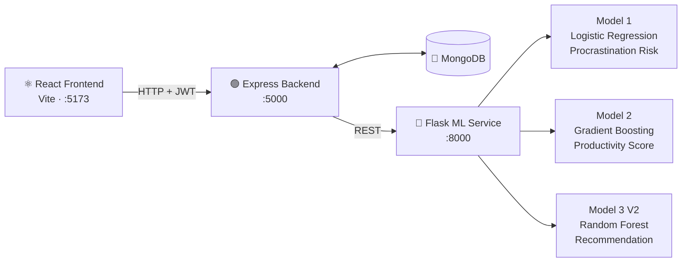
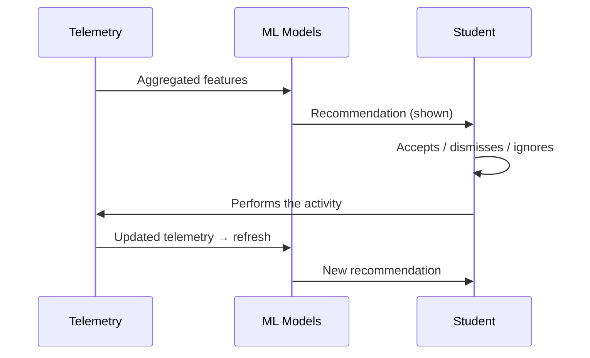

<div align="center">
      
# 🎓 EduPulse AI 
             
**An AI-powered student productivity platform that closes the loop between prediction and action.**
 
Most productivity apps track tasks and time. EduPulse AI goes further: it watches behavior, predicts what a student needs next, and — critically — measures whether that recommendation actually got acted on.
              
[](https://react.dev/)
[](https://vite.dev/)
[](https://nodejs.org/)
[](https://www.mongodb.com/)
[](https://www.python.org/)
[](https://flask.palletsprojects.com/)
[](https://scikit-learn.org/)
[](https://ai.google.dev/)
[](#license)

[Overview](#-overview) · [Architecture](#-architecture) · [ML System](#-machine-learning-system) · [Quick Start](#-quick-start) · [API](#-api-reference) · [Research](#-research--evaluation)

</div>

---

## 📌 Overview

Students don't usually fail from a lack of to-do apps — they fail from **not knowing what to do next**, and from tools that never learn from what happened last time.

EduPulse AI treats every study session, task, and idle minute as a signal. Three ML models turn that signal into a concrete next action ("Practice Coding," "Take a Short Break," "Revise"), and a closed-loop tracking system checks whether the student actually followed through — feeding the outcome back into the next prediction.

```text
Behavior → Features → Prediction → Recommendation → Action → New Behavior → …
```

**What it does:**

| | |
|---|---|
| 🧠 | Predicts procrastination risk, productivity score, and next-best-action from real behavior |
| 🔁 | Closes the loop — tracks whether recommendations are accepted, dismissed, or completed |
| 🗺️ | Generates day-by-day learning roadmaps with Gemini |
| ⏱️ | Tracks focus sessions, coding time, and task/skill progress |
| 🔐 | Fully multi-tenant with JWT auth and per-user data isolation |
| 📊 | Ships with an observational research pipeline evaluating its own recommendations |

---

## 🏗️ Architecture



The **backend** owns auth, database access, feature aggregation, and the recommendation lifecycle. The **ML service** owns inference only — a clean separation that keeps model iteration independent of application logic.

| Layer | Technology |
|---|---|
| Frontend | React 19 + Vite |
| Backend | Node.js + Express |
| Database | MongoDB + Mongoose |
| Auth | JWT |
| ML Service | Python + Flask + scikit-learn |
| Generative AI | Google Gemini 2.5 Flash |

---

## 🤖 Machine Learning System

Three models, each with a strict, validated feature contract between app and inference layer.

| Model | Algorithm | Input | Output |
|---|---|---|---|
| **1 — Procrastination Detection** | Logistic Regression | 11 features | `is_procrastinator`, `probability` |
| **2 — Productivity Prediction** | Gradient Boosting Regressor | 20 features | continuous score (0–100) |
| **3 V2 — Recommendation Engine** | Random Forest Classifier | 20 features | recommendation class + confidence |

<details>
<summary><strong>Model 3 V2 — the 20-feature contract</strong></summary>

<br>

`productivity_score` · `focus_score` · `study_hours` · `xp` · `level` · `streak_days` · `completed_tasks` · `pending_tasks` · `coding_hours` · `reading_hours` · `revision_hours` · `quiz_score` · `productive_minutes` · `distraction_minutes` · `idle_minutes` · `sleep_hours` · `skill_progress` · `deadline_completion_rate` · `focus_sessions` · `average_session_minutes`

</details>

### The 8 recommendation classes

| # | Recommendation | # | Recommendation |
|---|---|---|---|
| 0 | Continue Current Skill | 4 | Revise |
| 1 | Start Focus Session | 5 | Watch Learning Video |
| 2 | Take Short Break | 6 | Complete Pending Tasks |
| 3 | Practice Coding | 7 | Attempt Quiz |

**Example output**, surfaced by the AI Productivity Coach:

```json
{ "recommendation": "Practice Coding", "recommendation_class": 3, "confidence": 0.38 }
```

> "Technical mastery requires hands-on practice. Diving into coding challenges will reinforce recent concepts."

---

## 🔁 The Closed Loop

This is the core architectural idea: a recommendation isn't the end of the pipeline, it's the middle.



Every event is logged as a `RecommendationEvent` — model, class, confidence, and lifecycle status (`shown → accepted → completed`) — which is what makes the recommendations measurable rather than cosmetic.

To avoid noise, the system **debounces** rapid telemetry bursts into a single refresh and enforces a **30-minute cooldown** between duplicate recommendation events.

---

## ⚡ Quick Start

**Prerequisites:** Node.js 18+, Python 3.9+, MongoDB (local or Atlas), Git

```bash
# 1 — ML service
cd ml-service && python -m venv venv && source venv/bin/activate   # Windows: venv\Scripts\activate
pip install -r requirements.txt
python app.py                     # → http://localhost:8000

# 2 — Backend  (new terminal)
cd backend && npm install && npm start          # → http://localhost:5000

# 3 — Frontend (new terminal)
cd frontend && npm install && npm run dev        # → http://localhost:5173
```

**`backend/.env`**

```env
PORT=5000
MONGO_URI=<your-mongodb-connection-string>
JWT_SECRET=<your-jwt-secret>
GEMINI_API_KEY=<your-gemini-api-key>
ML_SERVICE_URL=http://localhost:8000
```

> Never commit real credentials. Start order: MongoDB → ML service → Backend → Frontend.

---

## 📡 API Reference

**ML Service** — `http://localhost:8000`

| Method | Endpoint | Purpose |
|---|---|---|
| `GET` | `/health` | Service + model health |
| `POST` | `/predict` | Procrastination risk (Model 1) |
| `POST` | `/predict/productivity` | Productivity score (Model 2) |
| `POST` | `/predict/recommendation` | Next-best-action (Model 3 V2) |

**Backend** — `http://localhost:5000` — auth, users, skills, tasks, focus sessions, telemetry, ML refresh, recommendation lifecycle, and app statistics, all behind JWT-protected, user-scoped routes.

---

## 🗂️ Project Structure

```text
EduPulse-AI/
├── frontend/       React + Vite client
├── backend/        Express API, controllers, models, services
├── ml-service/     Flask app, trained models, training scripts
├── extension/      Browser extension
├── evaluation/     Research + verification artifacts (kept out of prod code)
└── documentation/
```

---

## ✅ Testing & Verification

Verified in four phases, from static analysis through live concurrency testing — auth, all three model endpoints, the full recommendation lifecycle, debounce/cooldown, user isolation, and failure recovery (e.g. Express degrades gracefully if the ML service goes down).

| Phase | Scope | Result |
|---|---|---|
| A — Static | Repo, deps, lint, build, model/DB contracts | ✅ 0 critical/high/medium · 2 low |
| B — Live Service | ML inference, DB, auth, performance baseline | ✅ Clean |
| C — End-to-End | Full user journeys, recommendation lifecycle | ✅ Clean |
| D — Robustness | Concurrency, boundary values, invalid input, log security | ✅ Clean |

<details>
<summary><strong>Latency benchmarks</strong></summary>

<br>

| Component | Avg. Latency |
|---|---|
| Model 1 (Procrastination) | ~2.4 ms |
| Model 2 (Productivity) | ~5.0 ms |
| Model 3 V2 (Recommendation) | ~35.8 ms |
| Full ML refresh (DB → features → all 3 models) | ~322.2 ms |

Invalid/missing features → `400`. Missing/malformed/expired JWT → `401`. All-zero and max-boundary inputs return valid, non-NaN responses.

</details>

---

## 📊 Research & Evaluation

Beyond shipping the feature, the project asks: *do the recommendations actually get used?* An observational analysis (not a causal claim) was run over the canonical dataset of **N = 34** recommendation events.

| Metric | Value |
|---|---|
| Acceptance rate | 20.6% (7/34) |
| Completion rate | 14.7% (5/34) |
| Completion **given** acceptance | 85.7% (5/7) |
| Adherence at confidence ≥ 0.70 | 100% (n = 3 — too small to generalize) |

**Notable patterns:** low-productivity learners were recommended *Continue Current Skill* disproportionately often, while high-productivity learners saw a more diverse recommendation mix. 5 of 8 recommendation classes had observed events; 3 (Revise, Complete Pending Tasks, Attempt Quiz) had none.

<details>
<summary><strong>Methodology & limitations</strong></summary>

<br>

The analysis compares pre/post telemetry windows around each recommendation event and deliberately uses language like *observed association* and *descriptive analysis* rather than *caused* or *statistically significant* — the sample size doesn't support causal or population-level claims.

**Limitations:** small N (34), several classes with near-zero observations, observational (not experimental) design, and findings that shouldn't be generalized beyond this project's dataset. No production model weights or feature contracts were changed during testing or research.

</details>

---

## 🚧 Status & Roadmap

**Status:** Core app, all three ML models, the AI coach, recommendation tracking, telemetry, and auth are complete and validated end-to-end.

**Where this could go next:** larger longitudinal datasets, real user studies, A/B testing of recommendation strategies, model calibration and explainability work, and production deployment.

---

## 🤝 Contributing

Issues and focused PRs are welcome. Please avoid touching production ML artifacts without a validation pass, keep the existing feature contracts intact, and don't commit secrets or `.env` files.

## 📄 License

MIT — see [LICENSE](LICENSE).

## 👤 Author

**Abdul Samad** — B.Tech CS (AI & ML)
[GitHub](https://github.com/abdul-samad-001) · [LinkedIn](https://www.linkedin.com/in/abdul-samad025)
