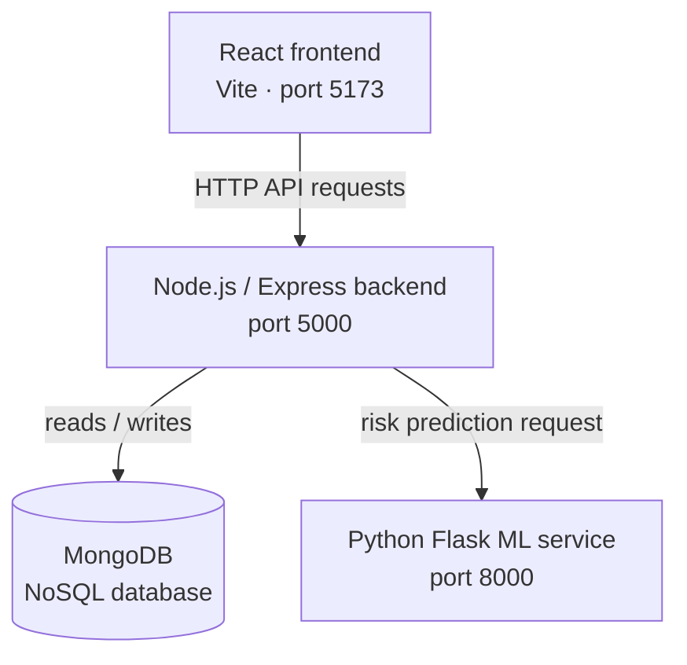
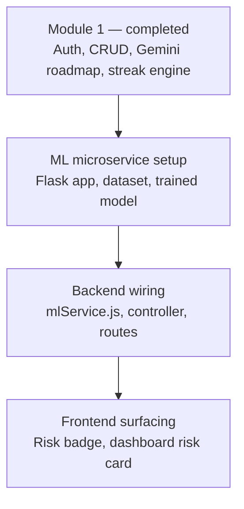

# EduPulse AI — Student Skill Tracker & Procrastination Detection
     
[](https://react.dev/)
[](https://expressjs.com/)
[](https://www.mongodb.com/)
[](https://flask.palletsprojects.com/)
[](https://ai.google.dev/)
[](#license)
 
EduPulse AI is a full-stack, AI-powered platform that helps students track academic skill acquisition and detect procrastination behavior using machine learning. It connects a **React frontend**, a **Node.js/Express backend** (with Google Gemini for AI-generated roadmaps), and a **Python Flask ML service** (scikit-learn, for procrastination risk detection).
 
---

## Table of Contents

- [Overview](#overview)
- [Architecture](#architecture)
- [Tech Stack](#tech-stack)
- [Features](#features)
- [Integration Roadmap](#integration-roadmap)
- [Getting Started](#getting-started)
- [Environment Variables](#environment-variables)
- [Contributing](#contributing)
- [License](#license)
- [Author](#author)

---

## Overview

EduPulse AI lets students define skills, break them into AI-generated day-wise task roadmaps, and track completion through a per-skill streak system. A separate machine learning microservice analyzes engagement patterns to flag procrastination risk, surfaced back to the student through the dashboard.

## Architecture



The frontend never talks to MongoDB or the ML service directly — all requests are routed through the Express backend, which owns both the database connection and the HTTP call to the Flask microservice.

## Tech Stack

| Layer | Technologies |
|---|---|
| Frontend | React (Vite) |
| Backend | Node.js, Express, JWT authentication |
| Database | MongoDB |
| AI Roadmaps | Google Gemini (`gemini-2.5-flash`) |
| ML Microservice | Python, Flask, scikit-learn |

## Features

**Completed (Module 1)**
- JWT-based authentication — register, login, and protected routes
- Skill and task CRUD — add, edit, and delete skills plus checklist milestones
- Gemini-generated roadmaps — automated day-wise checklists via `gemini-2.5-flash`
- Day-wise streak engine (`streakEngine.js`) — advances `currentDay` as daily tasks are completed and checks the 24-hour deadline

**In progress (Module 2 — Procrastination Detection)**
- Python ML microservice for procrastination risk scoring
- Backend wiring to expose `/api/procrastination` endpoints
- Frontend risk badge and dashboard-level risk summary

## Integration Roadmap

The procrastination detection module is being wired up in three stages:



### 1. ML Python microservice
- [ ] Create the `ml-service/` folder as a sibling to `backend/` and `frontend/`
- [ ] Add service scripts to `ml-service/`: `requirements.txt`, `app.py` (Flask server), `generate_dataset.py` (synthetic data generator), `train_models.py` (training script)
- [ ] Add data/model artifacts: `procrastination_dataset.csv` → `ml-service/data/`; `best_model.pkl`, `scaler.pkl`, `model_metadata.json` → `ml-service/models/`

### 2. Node.js backend wiring
- [ ] Add `mlService.js` to `backend/src/services/`
- [ ] Add `procrastinationController.js` to `backend/src/controllers/`
- [ ] Add `procrastinationRoutes.js` to `backend/src/routes/`
- [ ] Set `ML_SERVICE_URL=http://localhost:8000` in `backend/.env`
- [ ] Mount `/api/procrastination` routes in `backend/server.js`
- [ ] Fix the unreachable `checkStreakDeadline(skill)` call in `backend/src/controllers/taskController.js`

### 3. Frontend UI surfacing
- [ ] Add `procrastinationService.js` to `frontend/src/services/`
- [ ] Create `RiskBadge.jsx` in `frontend/src/components/skills/`
- [ ] Render `<RiskBadge skillId={skill._id} />` inside `frontend/src/components/skills/SkillCard.jsx`
- [ ] Update `frontend/src/pages/Dashboard.jsx` to fetch overall risk state and render an **Overall Procrastination Risk** card

## Getting Started

### Prerequisites
- Node.js 18+
- Python 3.9+
- MongoDB (local instance or Atlas connection string)

### Running the services locally

Start all three services in separate terminals.

**1. Python ML microservice**
```bash
cd ml-service
python -m venv venv
venv\Scripts\activate   # On Windows
pip install -r requirements.txt
python app.py
```
Runs on [http://localhost:8000](http://localhost:8000)

**2. Node.js Express backend**
```bash
cd backend
npm install
npm start
```
Runs on [http://localhost:5000](http://localhost:5000)

**3. Vite React frontend**
```bash
cd frontend
npm install
npm run dev
```
Runs on [http://localhost:5173](http://localhost:5173)

## Environment Variables

`backend/.env`
```
PORT=5000
MONGO_URI=<your MongoDB connection string>
JWT_SECRET=<your JWT signing secret>
GEMINI_API_KEY=<your Google Gemini API key>
ML_SERVICE_URL=http://localhost:8000
```

`ml-service/.env` (if applicable)
```
FLASK_PORT=8000
```

Adjust keys and values to match your actual configuration — the list above reflects the services described in this README.

## Contributing

Contributions are welcome. Please open an issue to discuss a change before submitting a pull request, and keep PRs focused on a single improvement or fix.

## License

This project is licensed under the MIT License. See the [LICENSE](LICENSE) file for details.

## Author

**Abdul Samad**
B.Tech — Computer Science (Artificial Intelligence & Machine Learning)
GitHub: [@abdul-samad-001](https://github.com/abdul-samad-001) · LinkedIn: [abdul-samad025](https://linkedin.com/in/abdul-samad025)
